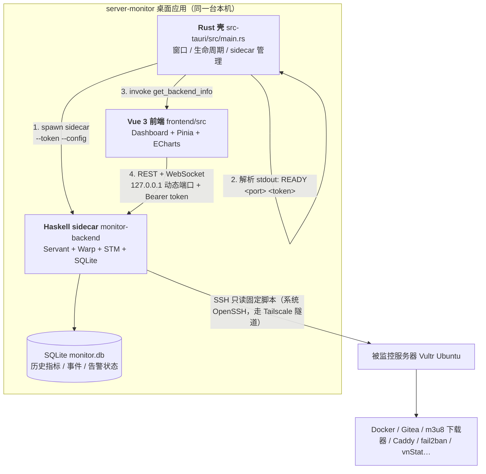
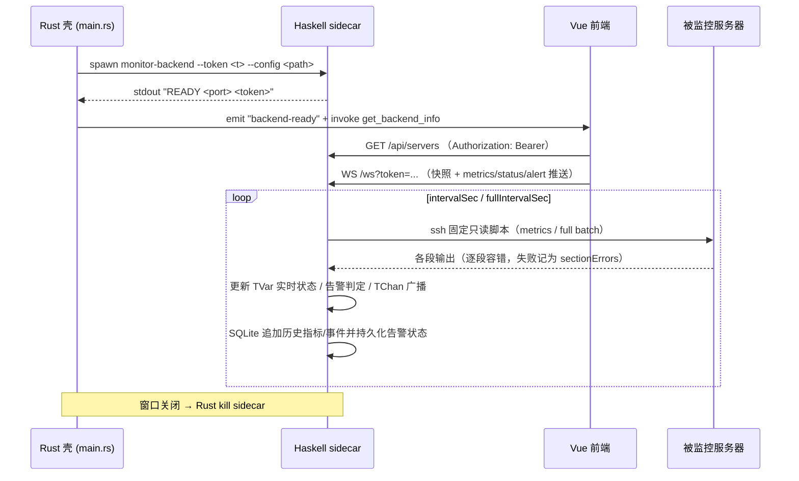
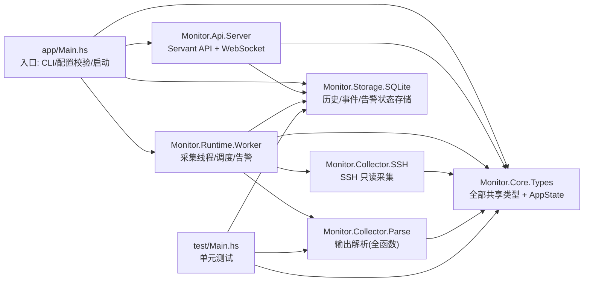
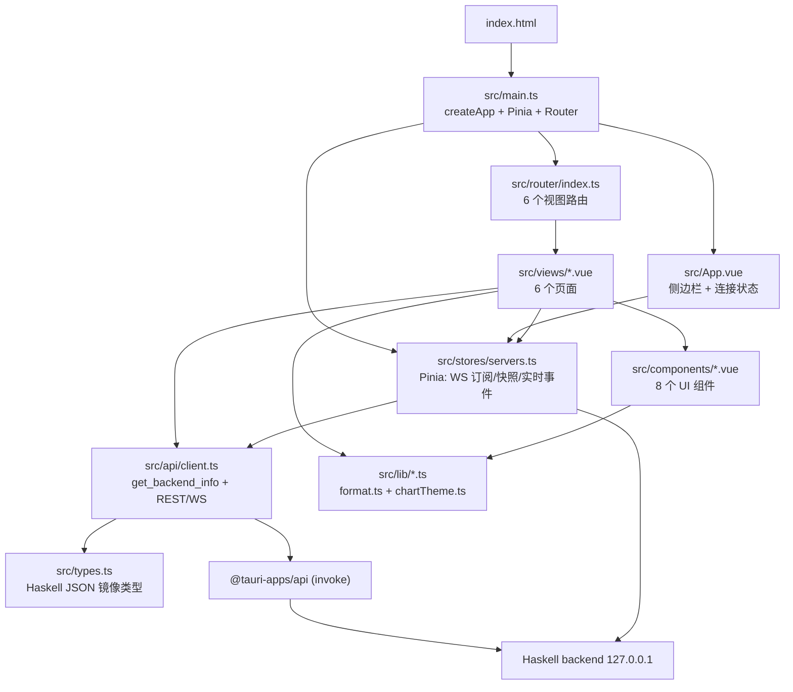
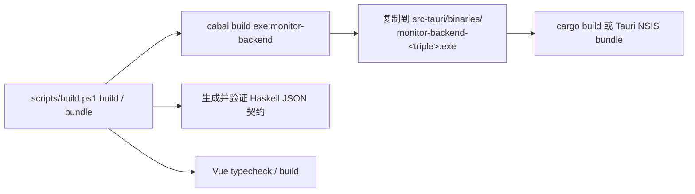

# server-monitor 架构图

> 本目录 `server-monitor` 是一个**本地只读服务器监控桌面应用**：
> Tauri 2（Rust）桌面壳 + Haskell（Servant/Warp/STM/SQLite）sidecar 后端 + Vue 3 前端。
> 本文覆盖仓库内**每一个文件**的职责与依赖关系。
> （仓库根目录的 `m3u8-v2-stage` 属另一个项目，不在本文范围。）

---

## 一、总体架构（运行时拓扑）



**关键设计**：前端与后端全部跑在本机，后端只绑定 `127.0.0.1`，端口由 OS 动态分配，
所有 REST 请求带 Bearer token；WebSocket 端点豁免 token（浏览器无法设置 WS 头），
但只推送只读指标。`Rust 壳` 只负责窗口 + sidecar 生命周期，业务逻辑 100% 在 Haskell 后端。

---

## 二、进程与通信



---

## 三、Haskell 后端模块依赖图



**分层规则**：`Core/Types` 是唯一被所有模块依赖的底层（无反向依赖）；
`Collector`、`Storage` 只依赖 `Core`；`Runtime/Worker` 编排 `Collector + Storage`；
`Api/Server` 只读 `AppState`（TVar/TChan）与 `Storage`；`app/Main.hs` 负责装配。

---

## 四、Vue 前端模块依赖图



---

## 五、构建 / 运行管线



---

## 六、完整文件清单（每个文件）

> 生成目录已省略并在文末说明：`frontend/node_modules`、`frontend/dist`、
> `src-tauri/target`、`backend/dist-newstyle`。

```
server-monitor/
├── README.md                    # 项目说明：技术栈 / 目录 / 构建 / API / 告警 / 调度
├── app-icon.png                 # 应用图标源图（打包用）
├── .gitignore                   # Git 忽略规则
├── .vscode/
│   └── tasks.json               # VS Code 任务（构建/运行快捷方式）
│
├── backend/                     # ── Haskell 后端（只读采集 + API）──
│   ├── monitor.cabal            # Cabal 工程定义：library / exe / test 与全部依赖
│   ├── cabal.project            # Cabal 项目配置：包、优化等级、ghc-options
│   ├── config.json              # 运行时配置：dbPath / alerts / collection / servers
│   ├── monitor.db               # 运行时 SQLite 数据库（历史指标与事件，数据文件）
│   ├── .vscode/
│   │   └── tasks.json           # 后端专用 VS Code 任务
│   ├── app/
│   │   └── Main.hs              # 入口：CLI(--token/--config)解析、配置校验、initDb、
│   │                            #   装配 AppState、startWorkers、runBackend
│   ├── src/Monitor/
│   │   ├── Core/
│   │   │   └── Types.hs         # 全部共享类型：ServerConfig/ServerState/Metrics/Alert/
│   │   │                        #   AlertConfig/CollectionConfig/MonitorEvent/AppState
│   │   ├── Collector/
│   │   │   ├── SSH.hs           # SSH 只读采集：固定全量/轻量脚本、async 超时、进程回收
│   │   │   └── Parse.hs         # 远程脚本输出解析（全函数：坏输入→空结果+sectionErrors）
│   │   ├── Runtime/
│   │   │   └── Worker.hs        # 每服务器一采集线程：分层调度/指数退避/去重告警引擎
│   │   ├── Storage/
│   │   │   └── SQLite.hs        # SQLite 历史：initDb/saveMetrics/saveEvent/loadHistory/
│   │   │                        #   loadRecentEvents/saveCaddyStats/loadCaddyStats/cleanup
│   │   └── Api/
│   │       └── Server.hs        # Servant API 类型 + 全部 GET 处理器 + WS 推送 + 认证中间件
│   └── test/
│       └── Main.hs              # 单元测试（monitor-tests）：批解析/段失败/存储
│
├── frontend/                    # ── Vue 3 + TS 前端（只读仪表盘）──
│   ├── index.html               # Vite 入口 HTML（#app + /src/main.ts）
│   ├── package.json             # 依赖：vue/vue-router/pinia/echarts/@tauri-apps/api
│   ├── package-lock.json        # npm 锁文件
│   ├── tsconfig.json            # TypeScript 编译器配置
│   ├── vite.config.ts           # Vite：端口 5173(strictPort)、Vue 插件、chrome105 目标
│   ├── .gitignore               # 忽略 node_modules / dist
│   ├── public/
│   │   ├── favicon.svg          # 站点图标
│   │   └── icons.svg            # 站内用 SVG 图标
│   └── src/
│       ├── main.ts              # 应用入口：createApp + Pinia + Router + 全局 UiIcon
│       ├── App.vue              # 根组件：侧边栏导航、后端连接状态、RouterView
│       ├── style.css            # 全局样式（布局/主题/组件样式）
│       ├── types.ts             # TS 类型镜像（Metrics/Container/Alert/EventRow/…，与
│       │                        #   Monitor.Core.Types 字段保持同步）
│       ├── vite-env.d.ts        # Vite 环境变量类型声明
│       ├── api/
│       │   └── client.ts        # API 客户端：Tauri 模式 invoke get_backend_info /
│       │                        #   浏览器模式 VITE_BACKEND_PORT；apiGet / openWebSocket
│       ├── router/
│       │   └── index.ts         # 路由表：/、/servers、/servers/:id、/events、/history、/settings
│       ├── stores/
│       │   └── servers.ts       # Pinia store：WS 连接/重连、snapshot/server/status/alert
│       │                        #   消息应用、liveEvents（≤250 条）
│       ├── lib/
│       │   ├── format.ts        # 格式化：fmtBytes/fmtRate/fmtPct/fmtDuration/fmtDateTime…
│       │   └── chartTheme.ts    # ECharts 统一配色(CHART) + lineOption/barOption 工厂
│       ├── components/
│       │   ├── UiIcon.vue       # SVG 图标组件（渲染 icons.ts 路径）
│       │   ├── icons.ts         # 内联 SVG path 集合（stroke 1.6, 24px, currentColor）
│       │   ├── Panel.vue        # 卡片容器组件
│       │   ├── StatusChip.vue   # 在线/离线/告警级别徽章
│       │   ├── MeterBar.vue     # 百分比进度条（CPU/内存/磁盘）
│       │   ├── LineChart.vue    # ECharts 折线图封装（按需引入）
│       │   ├── BarsChart.vue    # ECharts 柱状图封装（按需引入）
│       │   └── EmptyState.vue   # 无数据/未连接占位
│       └── views/
│           ├── OverviewView.vue     # 总览：在线数/平均 CPU 内存/告警/健康检查/证书
│           ├── ServersView.vue      # 服务器列表卡片
│           ├── ServerDetailView.vue # 详情：容器/服务/fail2ban/备份/端口/SSH 登录/曲线…
│           ├── EventsView.vue       # 事件流（按服务器/类型/级别过滤，轮询 /api/events）
│           ├── HistoryView.vue      # 历史指标曲线（/api/history，可切换指标与窗口）
│           └── SettingsView.vue     # 设置/关于：后端端口、模式、/api/health 状态
│
├── src-tauri/                   # ── Tauri 2 桌面壳（Rust）──
│   ├── Cargo.toml               # Rust 依赖：tauri / tauri-plugin-shell / serde / rand
│   ├── Cargo.lock               # Cargo 锁文件
│   ├── build.rs                 # tauri_build::build() 构建脚本
│   ├── tauri.conf.json          # 窗口尺寸/CSP/beforeDevCommand/devUrl/frontendDist/
│   │                            #   externalBin(binaries/monitor-backend)/bundle(nsis,msi)
│   ├── package.json             # @tauri-apps/cli 依赖
│   ├── package-lock.json        # npm 锁文件
│   ├── capabilities/
│   │   └── default.json         # 主窗口权限：core:default
│   ├── src/
│   │   └── main.rs              # 壳逻辑：生成 token→spawn sidecar→解析 READY→
│   │                            #   emit backend-ready / backend-exited→get_backend_info
│   │                            #   →关闭窗口时 kill sidecar
│   ├── binaries/                # sidecar 打包目录（构建产物）
│   │   ├── monitor-backend-x86_64-pc-windows-msvc.exe  # 编译后的 Haskell 后端
│   │   ├── config.json          # 随 exe 分发的配置副本
│   │   └── monitor.db           # 运行时数据库副本
│   ├── gen/schemas/             # Tauri 生成的 schema（capability 校验）
│   │   ├── acl-manifests.json
│   │   ├── capabilities.json
│   │   ├── desktop-schema.json
│   │   └── windows-schema.json
│   ├── monitor.db               # 运行时 SQLite 数据库副本（数据文件）
│   └── icons/                   # 应用图标（打包用）
│       ├── 32x32.png / 64x64.png / 128x128.png / 128x128@2x.png
│       ├── icon.png / icon.ico / icon.icns
│       ├── Square30x30Logo.png / Square44x44Logo.png / Square71x71Logo.png
│       ├── Square89x89Logo.png / Square107x107Logo.png / Square142x142Logo.png
│       ├── Square150x150Logo.png / Square284x284Logo.png / Square310x310Logo.png
│       ├── StoreLogo.png
│       ├── android/
│       │   ├── mipmap-anydpi-v26/ic_launcher.xml
│       │   ├── mipmap-hdpi/  (ic_launcher.png / ic_launcher_round.png / ic_launcher_foreground.png)
│       │   ├── mipmap-mdpi/  (同上 3 个)
│       │   ├── mipmap-xhdpi/ (同上 3 个)
│       │   ├── mipmap-xxhdpi/(同上 3 个)
│       │   ├── mipmap-xxxhdpi/(同上 3 个)
│       │   └── values/ic_launcher_background.xml
│       └── ios/
│           ├── AppIcon-20x20@1x.png / AppIcon-20x20@2x.png / AppIcon-20x20@2x-1.png / AppIcon-20x20@3x.png
│           ├── AppIcon-29x29@1x.png / AppIcon-29x29@2x.png / AppIcon-29x29@2x-1.png / AppIcon-29x29@3x.png
│           ├── AppIcon-40x40@1x.png / AppIcon-40x40@2x.png / AppIcon-40x40@2x-1.png / AppIcon-40x40@3x.png
│           ├── AppIcon-60x60@2x.png / AppIcon-60x60@3x.png
│           ├── AppIcon-76x76@1x.png / AppIcon-76x76@2x.png / AppIcon-83.5x83.5@2x.png
│           └── AppIcon-512@2x.png
│
├── scripts/
│   ├── build.ps1                # 统一 test/check/build/bundle/clean/contract/version
│   ├── set-version.ps1          # 同步 Tauri/Cargo/npm/Cabal 版本
│   ├── setup-updater.ps1        # 创建或轮换本地 updater 签名密钥
│   └── write-update-manifest.ps1 # 从签名 NSIS 产物生成 latest.json
│
└── docs/                        # 本地参考文档（HTML，离线查阅）
    ├── servant-api-type.html            # Servant 类型层参考
    ├── servant-home.html                # Servant 主页
    ├── servant-server-tutorial.html     # Servant server 教程
    ├── tauri-capabilities.html          # Tauri capability 机制
    ├── tauri-sidecar.html               # Tauri sidecar 机制
    ├── tauri-sidecar-capability-example.html  # sidecar capability 示例
    ├── tauri-webview-versions.html      # WebView2 版本说明
    ├── tauri-window-menu.html           # 窗口菜单参考
    ├── tauri-windows-installer.html     # Windows 安装包参考
    └── wai-websockets-api.html          # WAI WebSocket API 参考
```

---

## 七、API 一览（Haskell 后端，全部只读 GET）

```
GET /api/health                      # 状态 + 在线数 + 告警/采集配置
GET /api/servers                     # 完整状态快照（含 alerts / sectionErrors）
GET /api/servers/:id/containers      # Docker 容器
GET /api/servers/:id/services        # systemd 服务
GET /api/servers/:id/fail2ban        # fail2ban jail
GET /api/servers/:id/backup          # 备份信息
GET /api/history?server=:id&hours=24 # SQLite 历史指标
GET /api/caddy?server=:id&hours=168  # Caddy 日志大小趋势
GET /api/events?limit=50             # 结构化事件
WS  /ws                              # snapshot + metrics/status/alert 推送
```

---

## 附：未列入的生成目录（构建产物，非源码）

| 目录 | 来源 |
|---|---|
| `frontend/node_modules/` | `npm install` |
| `frontend/dist/` | `npm run build`（Vite 产物，Tauri 打包时使用） |
| `src-tauri/target/` | `cargo build` |
| `backend/dist-newstyle/` | `cabal build` |

---

## 八、跨语言边界

```text
Haskell ADT
    │ production ToJSON
    ▼
REST / WebSocket JSON ───────► Zod strict schema ───────► z.infer TypeScript type
    ▲                                  │
    │ monitor-contract samples         ├─ build-time Vitest contract check
    └──────────────────────────────────└─ runtime REST/WS decode
```

`frontend/src/types.ts` 是 JSON 边界的可执行规范，不能再维护独立的手写
TypeScript DTO。`backend/app/Contract.hs` 直接构造真实 Haskell ADT，并通过生产
`ToJSON` 覆盖 REST 完整态、空态和所有 WebSocket 变体。Zod 使用 strict object，
因此字段改名、缺失和多余字段都失败；协议错误只记录路径与原因，不打印 payload。

这套机制不宣称对 Haskell 与 TypeScript 做形式化等价证明。它提供的是更适合此
项目的双层保证：CI/本地构建执行生产序列化契约，运行时对每个外部 payload 再
解码一次。超出 JavaScript safe integer 的计数也会显式失败，不会静默丢精度。

## 九、桌面生命周期与更新

* single-instance 插件在其他插件之前初始化；第二实例不启动 sidecar，只聚焦主窗口。
* Windows 为 sidecar 建立 kill-on-close Job Object。关闭窗口会主动 kill child；壳异常退出时由内核关闭 Job handle 并回收 sidecar/SSH 后代。
* 开发配置的 updater endpoint 为空，不执行在线请求；发布构建才注入 GitHub Release endpoint。
* 更新包是 Tauri v2 的 NSIS `setup.exe + setup.exe.sig`，`latest.json` 指向安装器；客户端只安装通过仓库公钥验证的包。
* 私钥只存在于 `.local-secrets/` 或 CI Secrets。轮换密钥必须同时发布信任新公钥的旧密钥签名过渡版本，否则已安装客户端无法信任后续更新。
